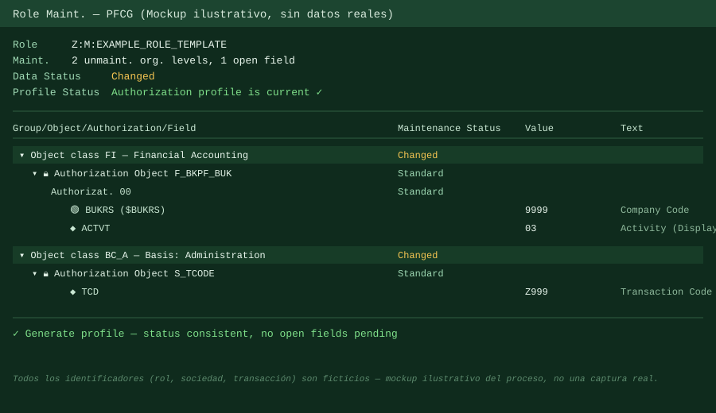
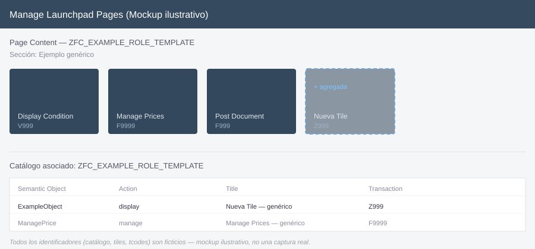
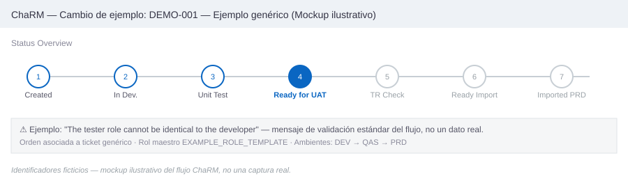

# Caso 1 — Agregar una transacción a un rol maestro ya existente

## Contexto

Solicitud de negocio para que un rol funcional ya en uso (perfil tipo "Analista de Tesorería") pudiera ejecutar una transacción financiera adicional para hacer ajustes manuales puntuales, transacción que hasta ese momento no tenía habilitada.

Llegó como ticket estándar, con justificación de negocio y aprobador identificado. Cambio acotado: una sola transacción, no un rol nuevo.

## Problema

El rol maestro no incluía la transacción requerida en su menú, y por lo tanto tampoco tenía generados los objetos de autorización asociados a ella. Sin este ajuste, el usuario podía entrar al módulo pero no ejecutar esa función puntual.

## Diagnóstico

1. Se registró el requerimiento en la planilla de control de roles y accesos del equipo — paso obligatorio antes de tocar nada, sirve como respaldo de qué se pidió, quién lo pidió y por qué.
2. Se identificó la estructura del rol: un **rol maestro** y varios **roles derivados** (uno por país/sociedad) que heredan de él. El ajuste debía hacerse una sola vez en el maestro para propagarse a todos los derivados — no editar cada derivado por separado.
3. Se confirmó que el cambio no generaba un conflicto de SoD evidente (una sola transacción de posteo manual, sin combinarse con una función de aprobación en el mismo rol).

## Solución

1. **PFCG (rol maestro)**: se incluyó la transacción en el menú, se ajustaron los objetos de autorización que el generador propuso por default (revisando que no quedaran valores más amplios de lo necesario), se generó el perfil y se validó el semáforo en verde (perfil consistente, sin campos abiertos pendientes).

   

2. **Fiori**: se actualizó el catálogo asociado para incluir el tile correspondiente a la nueva transacción, y se revisó que apareciera correctamente en el Space/Page del rol.

   

3. **ChaRM**: se creó la orden de cambio, se le asignaron las modificaciones de PFCG y catálogo, se transportó a través de los ambientes (Desarrollo → Calidad → Producción), y se confirmó la importación en todos los sistemas relevantes.

   
4. **Cierre**: se solicitó validación funcional al negocio una vez confirmada la importación en Productivo — no se cierra el ticket solo con "el transporte llegó", sino con confirmación de que el usuario final puede hacer lo que pidió.

## Lección / lo que se generalizó

- Cuando el rol tiene estructura maestro/derivado, el cambio siempre va en el maestro. Editar un derivado directamente para un ajuste que debería ir en el maestro genera inconsistencia entre países/sociedades a mediano plazo.
- Un cambio "pequeño" (una transacción) igual pasa por el ciclo completo (planilla → PFCG → Fiori → ChaRM → validación funcional). Saltarse pasos por parecer trivial es exactamente el tipo de atajo que después aparece como hallazgo en una auditoría.
- Separar explícitamente "el transporte llegó a producción" de "el usuario confirmó que funciona" evita cerrar tickets prematuramente.
