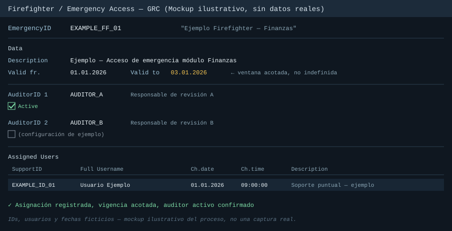

# Caso 4 — Asignar un Firefighter ID temporal a un usuario

## Contexto

Solicitud vía catálogo de servicio para otorgar acceso de emergencia (Firefighter) a un usuario que necesitaba ejecutar tareas puntuales fuera de su acceso estándar, por un período acotado y con justificación de negocio explícita.

## Problema

El usuario no tenía, ni debía tener de forma permanente, el nivel de acceso requerido para la tarea puntual. Había que otorgar un acceso elevado pero **trazable y temporal**, sin generar un rol permanente ni un riesgo de segregación de funciones (SoD) indefinido — ver [`01-conceptos-autorizacion.md`](../01-conceptos-autorizacion.md), sección 5.

## Diagnóstico

1. Se identificó cuál **Firefighter ID** del catálogo correspondía al alcance necesitado. No es un acceso "genérico a todo": cada Firefighter ID está predefinido para un dominio/módulo específico (en este caso, Finanzas), así que elegir el correcto — no el más amplio disponible — es parte del trabajo.
2. Se confirmó la ventana de tiempo solicitada (Valid from / Valid to). El acceso Firefighter siempre debe tener vigencia acotada, nunca indefinida.
3. Se verificó qué auditor(es) estaban configurados para ese Firefighter ID (AuditorID 1 obligatorio, AuditorID 2 opcional según el alcance) — son quienes deben revisar el log de uso una vez que el acceso se haya utilizado.

## Solución

1. Se asignó al usuario en la configuración del Firefighter ID correspondiente, con vigencia acotada a la ventana solicitada.

   

2. Se confirmó que el auditor responsable estuviera activo para ese Firefighter ID — sin auditor activo, no hay quien revise el log de uso después, y el control pierde sentido.
3. Se validó la asignación en la lista de "Assigned Users" del Firefighter ID, confirmando usuario, fecha de asignación y descripción del motivo.
4. Se notificó por correo a las partes interesadas (solicitante y equipo/aprobadores involucrados) confirmando la asignación, incluyendo la vigencia y el ID del Firefighter — deja rastro auditable de quién aprobó qué y cuándo, más allá de lo que quede guardado en el sistema.
5. Se cerró la tarea en el sistema de tickets.

## Lección / lo que se generalizó

- Un Firefighter ID no es "acceso total temporal": está acotado a un dominio/proceso específico. Asignar el ID equivocado (uno más amplio "por si acaso") anula el propósito del control.
- La vigencia acotada (Valid from/to) es el control más importante de todo el proceso. Sin fecha de término, un Firefighter deja de ser "acceso de emergencia trazable" y se convierte en un acceso permanente sin control — justo lo que este mecanismo existe para evitar.
- El auditor asociado no es un campo administrativo más: si no está activo o no revisa el log después del uso, el control real (que ocurre *después*, en la revisión) simplemente no está funcionando, aunque el acceso se haya otorgado "correctamente".
- Confirmar por escrito la asignación (correo, con fechas e ID incluidos) genera el rastro que después se pide en una auditoría — no basta con que quede guardado únicamente en el sistema transaccional.
