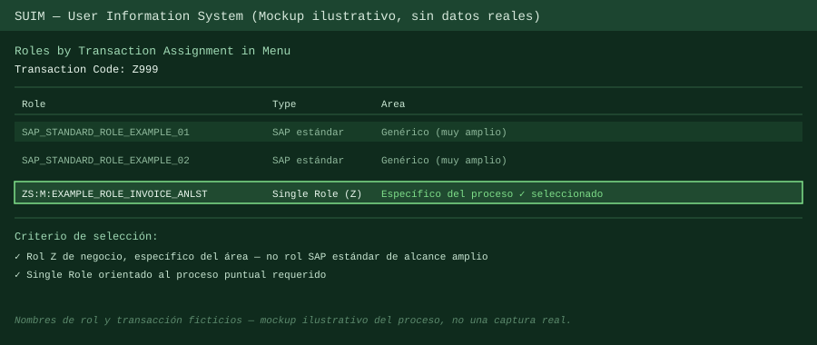

# Caso 7 — Encontrar el rol correcto cuando falta un T-Code

## Contexto

Un usuario reportó no poder ejecutar una transacción específica (en este caso, `MIRO`, verificación de facturas). Había que identificar qué rol otorgaba esa transacción y asignárselo — sin recurrir al primer rol que apareciera disponible.

## Problema

Falta un T-Code puntual. La solución "obvia" (buscar cualquier rol que lo contenga y asignarlo) es exactamente lo que hay que evitar: muchos roles estándar de SAP contienen transacciones comunes junto con un alcance mucho más amplio del necesario, lo que generaría sobre-otorgamiento de acceso.

## Diagnóstico

1. Se confirmó el T-Code exacto que faltaba, obteniéndolo del trace de autorización del usuario (`SU53` o `STAUTHTRACE`) — no asumido de la descripción del ticket, sino verificado técnicamente.
2. Se usó `SUIM` → **Roles** → **By Transaction Assignment in Menu**, buscando por el T-Code, para obtener el listado completo de roles que lo incluyen.
3. El resultado típico mezcla roles estándar de SAP (de alcance amplio, genéricos) con roles Z de negocio (específicos del proceso). Elegir entre ellos es la parte que realmente importa del caso.

## Solución

1. De la lista de roles que contenían el T-Code, se priorizó un **rol Z de negocio, Single Role, específico del proceso** (en este caso, orientado a procesamiento de facturas) por sobre los roles estándar de SAP de alcance más amplio.
2. Se asignó ese rol al usuario vía `SU01`.

   

3. Se solicitó al usuario volver a probar la transacción.
4. Como práctica de respaldo: si el error persistía, el siguiente paso era volver a ejecutar `SU53` para revisar si aparecían *nuevos* objetos de autorización faltantes (a veces un rol resuelve el acceso al T-Code pero no todos los objetos de autorización que la transacción evalúa en tiempo de ejecución).

## Lección / lo que se generalizó

- Buscar "un rol que tenga el T-Code" no es el criterio correcto — el criterio es encontrar el rol **más acotado posible** que lo tenga, priorizando roles Z de negocio específicos del área por sobre roles SAP estándar genéricos.
- Asignar el primer rol disponible que resuelve el síntoma es la forma más común de terminar con usuarios sobre-privilegiados. Cada asignación de rol es una decisión de alcance, no solo de "que funcione".
- Confirmar con el área funcional cuando hay dudas sobre qué rol de negocio corresponde evita asignar algo técnicamente correcto (el T-Code aparece) pero funcionalmente inadecuado (el rol trae de arrastre otros procesos que no le corresponden al usuario).
- El diagnóstico no termina cuando el usuario deja de reportar el error — vale la pena tener presente que un mismo síntoma (T-Code bloqueado) puede requerir más de una iteración si aparecen objetos de autorización adicionales.
